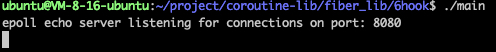
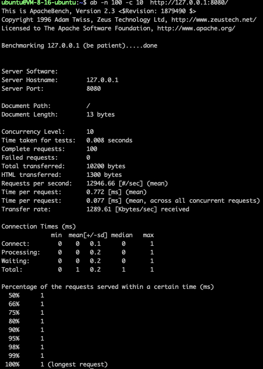

# 项目概述

> ⭐️ 本项目为[【代码随想录知识星球】](https://programmercarl.com/other/kstar.html) 教学项目   
> ⭐️ 在 [手写协程库项目专栏](https://programmercarl.com/other/project_coroutine.html)  里详细讲解：**项目前置知识 + 项目细节 +  代码解读 + 项目难点 + 面试题与回答 + 简历写法  + 项目拓展**。 全面帮助你用这个项目求职面试！


本项目是对sylar服务器框架的改编和简化，专注于协程库的部分。通过引入协程、调度器和定时器等核心模块，利用HOOK技术将Linux系统中的传统同步函数（如 `sleep`、`read`、`write` 等）转化为异步版本。此改造允许保持同步I/O的编程方式，同时享受异步执行的效率和响应速度提升。

## 运行环境

Ubuntu 22.04 LTS

## 编译指令

首先进入文件所在目录
```shell
cd coroutine-lib && cd fiber_lib && cd 6hook 
```

在6hook文件下编译链接可执行文件
```shell
g++ *.cpp -std=c++17 -o main -ldl -lpthread
```

执行可执行文件
```shell
./main
```
如图： 



### 测试工具的使用：
在ubuntu安装
```shell
sudo apt update
sudo apt install apache2-utils
```

判断是否安装成功
```shell
ab -V
```

### 通过测试工具运行项目:

**注意别忘记启动main可执行程序，并且额外开一个窗口执行以下内容**

测试工具apache的命令使用的是:

```shell
ab -n 100 -c 10  http://127.0.0.1:8080/
```

如图： 


* -n 连接数
* -c 并发数

可以根据自己的服务器的CPU数量，适当调整 测试连接数 和 并发数的数量。

## 主要模块介绍

### 协程类
* 使用非对称的独立栈协程。
* 支持调度协程与任务协程之间的高效切换。

### 调度器
* 结合线程池和任务队列维护任务。
* 工作线程采用FIFO策略运行协程任务，并负责将epoll中就绪的文件描述符事件和超时任务加入队列。

### 定时器
* 利用最小堆算法管理定时器，优化超时回调函数的获取效率。

## 关键技术点

* 线程同步与互斥
* 线程池管理
* epoll的事件驱动模型
* Linux网络编程
* 泛型编程
* 同步与异步I/O
* HOOK技术

## 待优化和扩展功能

### 内存池优化
当前协程在创建时自动分配独立栈空间，销毁时释放，引入频繁的系统调用。通过内存池技术优化可减少系统调用，提高内存使用效率。

### 协程嵌套支持
目前只支持主协程与子协程之间的切换，无法实现协程的嵌套。参考libco的设计，实现更复杂的协程嵌套功能，允许在协程内部再次创建新的协程层级。

### 复杂调度算法
引入类似操作系统的进程调度算法，如优先级、响应比和时间片等，以支持更复杂的调度策略，满足不同场景下的需求。

## 核心概念详解
### 同步I/O（Synchronous I/O）
应用程序执行I/O操作必须等待操作完成，期间应用程序被阻塞，无法执行其他任务。

### 异步I/O（Asynchronous I/O）
应用程序可以在I/O操作执行过程中继续执行其他代码，I/O操作通过事件回调机制完成通知。

### HOOK技术
对系统底层函数进行封装，增强功能且保持原有调用接口的兼容性，使函数在保持原有调用方式的同时，增加新的功能实现。

## 性能测试 

写完了协程库，我们势必要对其进行一些测试来验证我们写的协程库是否有用，相比于其他库有什么优势，分析出使用场景和性能瓶颈：

* 你是否对你写的协程库进行过测试？
* 你这个协程库相比于其他库有什么优势？ 

这些问题也是面试官经常会问到的，性能测试也是比较容易体现出我们思考和能力的环节，进行详细的性能也会成为项目的一大亮点。 

该部分在 [协程库项目专栏](https://programmercarl.com/other/project_coroutine.html) 有详细讲解，以本项目、libco协程库、libevent网络库以及原生epoll分别编写单线程回声服务器，使用ApacheBench测试工具分别进行压力测试。
